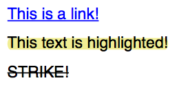

# Annotations in PDFKit

Annotations are interactive features of the PDF format, and they make it
possible to include things like links and attached notes, or to highlight,
underline or strikeout portions of text. Annotations are added using the
various helper methods, and each type of annotation is defined by a rectangle
and some other properties. Here is a list of the available annotation methods:

* `note(x, y, width, height, contents, options)`
* `link(x, y, width, height, url, options)`
* `goTo(x, y, w, h, name, options)`
* `highlight(x, y, width, height, options)`
* `underline(x, y, width, height, options)`
* `strike(x, y, width, height, options)`
* `lineAnnotation(x1, y1, x2, y2, options)`
* `rectAnnotation(x, y, width, height, options)`
* `ellipseAnnotation(x, y, width, height, options)`
* `textAnnotation(x, y, width, height, text, options)`
* `fileAnnotation(x, y, width, height, file, options)`

Many of the annotations have a `color` option that you can specify. You can
use an array of RGB values, a hex color, a named CSS color value, or a named
spot color value for that option.

A custom icon can be set using option `Name` property. Possible values are:
`'Comment'`, `'Key'`, `'Note'`, `'Help'`, `'NewParagraph'`, `'Paragraph'`
and `'Insert'`.

If you are adding an annotation to a piece of text, such as a link or
underline, you will need to know the width and height of the text in order to
create the required rectangle for the annotation. There are two methods that
you can use to do that. To get the width of any piece of text in the current
font, just call the `widthOfString` method with the string you want to
measure. To get the line height in the current font, just call the
`currentLineHeight` method.

You must remember that annotations have a stacking order. If you are putting
more than one annotation on a single area and one of those annotations is a
link, make sure that the link is the last one you add, otherwise it will be
covered by another annotation and the user won't be able to click it.

* * *

Here is an example that uses a few of the annotation types.

    // Add the link text
    doc.fontSize(25)
       .fillColor('blue')
       .text('This is a link!', 20, 0);

    // Measure the text
    const width = doc.widthOfString('This is a link!');
    const height = doc.currentLineHeight();

    // Add the underline and link annotations
    doc.underline(20, 0, width, height, {color: 'blue'})
       .link(20, 0, width, height, 'http://google.com/');

    // Create the highlighted text
    doc.moveDown()
       .fillColor('black')
       .highlight(20, doc.y, doc.widthOfString('This text is highlighted!'), height)
       .text('This text is highlighted!');

    // Create text with a spot color
    doc.addSpotColor('PANTONE185C', 0, 100, 78, 9)
    doc.moveDown()
       .fillColor('PANTONE185C')
       .text('This text uses spot color!');

    // Create the crossed out text
    doc.moveDown()
       .strike(20, doc.y, doc.widthOfString('STRIKE!'), height)
       .text('STRIKE!');

    // Create note
    doc.note(10, 30, 30, 30, "Text of note");

    // Create note with custom options
    doc.note(10, 80, 30, 30, "Text of custom note", {Name: 'Key', color: 'red'});

    // Adding go to as annotation
    doc.goTo(20, doc.y, 10, 20, 'LINK', {});

The output of this example looks like this.

Annotations are currently not the easiest things to add to PDF documents, but
that is the fault of the PDF spec itself. Calculating a rectangle manually isn't
fun, but PDFKit makes it easier for a few common annotations applied to text, including
links, underlines, and strikes.  Here's an example showing two of them:

    doc.fontSize(20)
       .fillColor('red')
       .text('Another link!', 20, 0, {
         link: 'http://apple.com/',
         underline: true
       }
    );

The output is as you'd expect:

