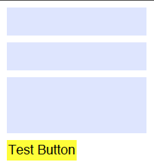

# AcroForms in PDFKit

AcroForms are interactive features of the PDF format, and they make it possible
to include things like text fields, buttons and actions. To include AcroForms
you must call the `document.initAcroForm()` method.

AcroForm elements are _widget_ annotations and are added using the
`widgetAnnotation` method. Other methods are shortcut methods that call the
`widgetAnnotation` method. Here is a list of the available _Widget Annotation_
methods:

* `widgetAnnotation( name, x, y, width, height, options)`
* `formText( name, x, y, width, height, options)`
* `formPushButton( name, x, y, width, height, name, options)`
* `formRadioButton( name, x, y, width, height, options)`
* `formNoToggleToOffButton( name, x, y, width, height, options)`
* `formChoice( name, x, y, width, height, options)`

Some Widget Annotations have a `color` option that you can specify. You can use
an array of RGB values, a hex color, or a named CSS color value for that option.
For example, form buttons can have a `backgroundColor` and `borderColor`.

Other `options` conveniences include:

* `label` - set button text labels (MK.CA)
* `align` - set to `left`, `center` or `right` for text within the Widget Annotation
* Field flags to set `Ff`
  * readyOnly: 1,
  * required: 2,
  * noExport: 4,
  * multiline: 0x1000,
  * password: 0x2000,
  * toggleToOffButton: 0x4000,
  * radioButton: 0x8000, (also set when calling `formRadioButton`)
  * pushButton: 0x10000 (also set when calling `formPushButton`)
  * toggleToOffButton: 0x10000 (also set when calling `formNoToggleToOffButton`)
  * combo: 0x20000,
  * edit: 0x40000,
  * sort: 0x80000

When using `formChoice`, set `options.Opt` to the array of choices.

The font used for a Widget Annotation is set using the `document.font` method.

Widget Annotations are, by default, added to the Catalog's `AcroForm` dictionary
as an array of `Fields`. Fields are organized in a name heirarchy, for example
_shipping.address.street_. You can either set the `name` of each Widget
Annotation with the full name (e.g. _shipping.address.street_) or you can create
parent Fields. In this example you might have a _shipping_ field that is added
to the AcroForm Fields array, an _address_ field that refers to the _shipping_
Field as it's parent, and a _street_ Widget Annotation which would refer to the
_address_ field as it's parent. To create a field use:

* `field( name, options )` returns a reference to the field

To specify the parent of a _Field_ or _Widget Annotation_, set the `parent`
option to the field reference.

In support of Widget Annotations that execute PDF JavaScript, you can call the following method:

* `addNamedJavaScript( name, buffer )`

There is an important caveat when using AcroForms with PDFKit. Form elements
must each have an _appearance_ set using the _AP_ attribute of the annotation.
If this attribute is not set, the form element _may_ not be visible. Because
appearances can be complex to generate, Adobe Acrobat has an option to build
these apperances when a PDF is opened. To do this PDFKit sets the AcroForm
dictionary's _NeedAppearances_ attribute to true. This could mean that the PDF
will be _dirty_ upon open, meaning it will need to be saved. It is also
important to realize that the _NeedAppearances_ flag may not be honored by PDF
viewers that don't implement this aspect of the PDF Reference. 

A final note on _NeedAppearances_ is that for some form documents you may not
need to generate appearances. We believe this to be the case for text widget
annotations that are initially blank. It is not true for push button widget
annotations.

* * *

Here is an example that uses a few of the AcroForm field types.

    // Add the link text
    doc.fontSize(25)
       .fillColor('blue')
       .text('This is a link!', 20, 0);

    // Measure the text
    const width = doc.widthOfString('This is a link!');
    const height = doc.currentLineHeight();

    // Add the underline and link annotations
    doc.underline(20, 0, width, height, {color: 'blue'})
       .link(20, 0, width, height, 'http://google.com/');

    // Create the highlighted text
    doc.moveDown()
       .fillColor('black')
       .highlight(20, doc.y, doc.widthOfString('This text is highlighted!'), height)
       .text('This text is highlighted!');

    // Create the crossed out text
    doc.moveDown()
       .strike(20, doc.y, doc.widthOfString('STRIKE!'), height)
       .text('STRIKE!');

    // Adding go to as annotation
    doc.goTo(20, doc.y, 10, 20, 'LINK', {});

The output of this example looks like this.

