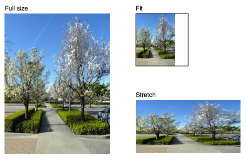

# Images in PDFKit

Adding images to PDFKit documents is an easy task. Just pass an image path to
the `image` method along with some optional arguments. PDFKit supports the
JPEG and PNG formats. If an X and Y position are not provided, the image is
rendered at the current point in the text flow (below the last line of text).
Otherwise, it is positioned absolutely at the specified point. The image will
be scaled according to the following options.

* Neither `width` or `height` provided - image is rendered at full size
* `width` provided but not `height` - image is scaled proportionally to fit in the provided `width`
* `height` provided but not `width` - image is scaled proportionally to fit in the provided `height`
* Both `width` and `height` provided - image is stretched to the dimensions provided
* `scale` factor provided - image is scaled proportionally by the provided scale factor
* `fit` array provided - image is scaled proportionally to fit within the passed width and height

Here is an example showing some of these options.

    # Scale proprotionally to the specified width
    doc.image('images/test.jpeg', 0, 15, width: 300)
       .text('Proprotional to width', 0, 0)
     
    # Fit the image within the dimensions
    doc.image('images/test.jpeg', 320, 15, fit: [100, 100])
       .rect(320, 15, 100, 100)
       .stroke()
       .text('Fit', 320, 0)
      
    # Stretch the image
    doc.image('images/test.jpeg', 320, 145, width: 200, height: 100)
       .text('Stretch', 320, 130)
       
    # Scale the image
    doc.image('images/test.jpeg', 320, 280, scale: 0.25)
       .text('Scale', 320, 265)
       
* * *

This example produces the following output:

That is all there is to adding images to your PDF documents with PDFKit. Now
let's look at adding annotations.