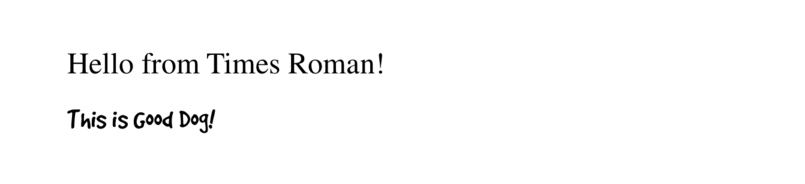

# Text in PDFKit

## The basics

PDFKit makes adding text to documents quite simple, and includes many options
to customize the display of the output. Adding text to a document is as simple
as calling the `text` method.

    doc.text 'Hello world!'

Internally, PDFKit keeps track of the current X and Y position of text as it
is added to the document. This way, subsequent calls to the `text` method will
automatically appear as new lines below the previous line. However, you can
modify the position of text by passing X and Y coordinates to the `text`
method after the text itself.

    doc.text 'Hello world!', 100, 100

If you want to move down or up by lines, just call the `moveDown` or `moveUp`
method with the number of lines you'd like to move (1 by default).

## Line wrapping and justification

PDFKit includes support for line wrapping out of the box! If no options are
given, text is automatically wrapped within the page margins and placed in the
document flow below any previous text, or at the top of the page. PDFKit
automatically inserts new pages as necessary so you don't have to worry about
doing that for long pieces of text. PDFKit can also automatically wrap text
into multiple columns.

If you pass a specific X and Y position for the text, it will not wrap unless
you also pass the `width` option, setting the width the text should be wrapped
to. If you set the `height` option, the text will be clipped to the number of
lines that can fit in that height.

When line wrapping is enabled, you can choose a text justification. There are
four options: `left` (the default), `center`, `right`, and `justify`. They
work just as they do in your favorite word processor, but here is an example
showing their use in a text box.
    
    lorem = 'Lorem ipsum dolor sit amet, consectetur adipiscing elit. Etiam in suscipit purus.  Vestibulum ante ipsum primis in faucibus orci luctus et ultrices posuere cubilia Curae; Vivamus nec hendrerit felis. Morbi aliquam facilisis risus eu lacinia. Sed eu leo in turpis fringilla hendrerit. Ut nec accumsan nisl.'
    
    doc.fontSize 8
    doc.text 'This text is left aligned. ' + lorem,
      width: 410
      align: 'left'
    
    doc.moveDown()
    doc.text 'This text is centered. ' + lorem,
      width: 410
      align: 'center'
    
    doc.moveDown()
    doc.text 'This text is right aligned. ' + lorem, 
      width: 410
      align: 'right'
    
    doc.moveDown()
    doc.text 'This text is justified. ' + lorem, 
      width: 410
      align: 'justify'
      
    # draw bounding rectangle
    doc.rect(doc.x, 0, 410, doc.y).stroke()

The output of this example, looks like this:

## Text styling

PDFKit has many options for controlling the look of text added to PDF
documents, which can be passed to the `text` method. They are enumerated
below.

* `lineBreak` - set to `false` to disable line wrapping all together
* `width` - the width that text should be wrapped to (by default, the page width minus the left and right margin)
* `height` - the maximum height that text should be clipped to
* `ellipsis` - the character to display at the end of the text when it is too long. Set to `true` to use the default character.
* `columns` - the number of columns to flow the text into
* `columnGap` - the amount of space between each column (1/4 inch by default)
* `indent` - the amount in PDF points (72 per inch) to indent each paragraph of text
* `paragraphGap` - the amount of space between each paragraph of text
* `lineGap` - the amount of space between each line of text
* `wordSpacing` - the amount of space between each word in the text
* `characterSpacing` - the amount of space between each character in the text
* `fill` - whether to fill the text (`true` by default)
* `stroke` - whether to stroke the text
* `link` - a URL to link this text to (shortcut to create an annotation)
* `underline` - whether to underline the text
* `strike` - whether to strike out the text
* `continued` - whether the text segment will be followed immediately by another segment. Useful for changing styling in the middle of a paragraph.

Additionally, the fill and stroke color and opacity methods described in the
[vector graphics section](vector.html) are applied to text content as well.

* * *

Here is an example combining some of the options above, wrapping a piece of text into three columns, in a specified width and height.
   
    lorem = 'Lorem ipsum dolor sit amet, consectetur adipiscing elit. Etiam in suscipit purus. Vestibulum ante ipsum primis in faucibus orci luctus et ultrices posuere cubilia Curae; Vivamus nec hendrerit felis. Morbi aliquam facilisis risus eu lacinia. Sed eu leo in turpis fringilla hendrerit. Ut nec accumsan nisl. Suspendisse rhoncus nisl posuere tortor tempus et dapibus elit porta. Cras leo neque, elementum a rhoncus ut, vestibulum non nibh. Phasellus pretium justo turpis. Etiam vulputate, odio vitae tincidunt ultricies, eros odio dapibus nisi, ut tincidunt lacus arcu eu elit. Aenean velit erat, vehicula eget lacinia ut, dignissim non tellus. Aliquam nec lacus mi, sed vestibulum nunc. Suspendisse potenti. Curabitur vitae sem turpis. Vestibulum sed neque eget dolor dapibus porttitor at sit amet sem. Fusce a turpis lorem. Vestibulum ante ipsum primis in faucibus orci luctus et ultrices posuere cubilia Curae;'   
    
    doc.text lorem,
      columns: 3
      columnGap: 15
      height: 100
      width: 465
      align: 'justify'

The output looks like this:

## Rich Text

As mentioned above, PDFKit supports a simple form of rich text via the `continued` option.
When set to true, PDFKit will retain the text wrapping state between `text` calls. This way,
when you call text again after changing the text styles, the wrapping will continue right
where it left off.

The options given to the first `text` call are also retained for subsequent calls after a 
`continued` one, but of course you can override them.  In the following example, the `width`
option from the first `text` call is retained by the second call.

    doc.fillColor 'green'
       .text lorem.slice(0, 500),
         width: 465
         continued: yes
       .fillColor 'red'
       .text lorem.slice(500)
       
Here is the output:
       

## Fonts

The PDF format defines 14 standard fonts that can be used in PDF documents (4
styles of Helvetica, Courier, and Times, as well as Symbol and Zapf Dingbats),
but also allows fonts to be embedded right in the document. PDFKit supports
embedding font files in the TrueType (`.ttf`), TrueType Collection (`.ttc`),
and Datafork TrueType (`.dfont`) formats.

To change the font used to render text, just call the `font` method. If you
are using a standard PDF font, just pass the name to the `font` method.
Otherwise, pass the path to the font file, or a `Buffer` containing the font data.
If the font is a collection font (`.ttc` and `.dfont` files), meaning that it 
contains multiple styles in the same file, you should pass the name of the style 
to be extracted from the collection.

Here is an example showing how to set the font in each case.

    # Set the font size
    doc.fontSize(18)
     
    # Using a standard PDF font
    doc.font('Times-Roman')
       .text('Hello from Times Roman!')
       .moveDown(0.5)
     
    # Using a TrueType font (.ttf)   
    doc.font('fonts/GoodDog.ttf')
       .text('This is Good Dog!')
       .moveDown(0.5)
     
    # Using a collection font (.ttc or .dfont)   
    doc.font('fonts/Chalkboard.ttc', 'Chalkboard-Bold')
       .text('This is Chalkboard, not Comic Sans.')

The output of this example looks like this:

Another nice feature of the PDFKit font support, is the ability to register a
font file under a name for use later rather than entering the path to the font
every time you want to use it.

    # Register a font
    doc.registerFont('Heading Font', 'fonts/Chalkboard.ttc', 'Chalkboard-Bold')
     
    # Use the font later
    doc.font('Heading Font')
       .text('This is a heading.')

That's about all there is too it for text in PDFKit. Let's move on now to
images.
