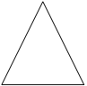
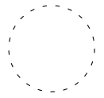
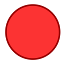
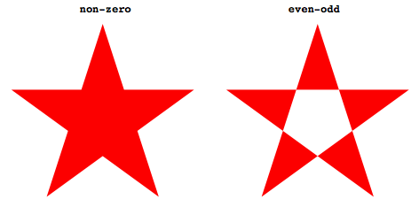
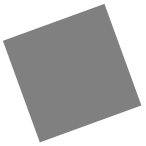

# Vector Graphics in PDFKit

## An introduction to vector graphics

Unlike images which are defined by pixels, vector graphics are defined through
a series of drawing commands. This makes vector graphics scalable to any size
without a reduction in quality (pixelization). The PDF format was designed
with vector graphics in mind, so creating vector drawings is very easy. The
PDFKit vector graphics APIs are very similar to that of the HTML5 canvas
element, so if you are familiar at all with that API, you will find PDFKit
easy to pick up.

### Creating basic shapes

Shapes are defined by a series of lines and curves. `lineTo`, `bezierCurveTo`
and `quadraticCurveTo` all draw from the current point (which you can set with
`moveTo`) to the specified point (always the last two arguments). Bezier
curves use two control points and quadratic curves use just one. Here is an
example that illustrates defining a path.

    doc.moveTo(0, 20)                               # set the current point
       .lineTo(100, 160)                            # draw a line
       .quadraticCurveTo(130, 200, 150, 120)        # draw a quadratic curve
       .bezierCurveTo(190, -40, 200, 200, 300, 150) # draw a bezier curve
       .lineTo(400, 90)                             # draw another line
       .stroke()                                    # stroke the path

The output of this example looks like this:

One thing to notice about this example is the use of method chaining. All
methods in PDFKit are chainable, meaning that you can call one method right
after the other without referencing the `doc` variable again. Of course, this
is an option, so if you don't like how the code looks when chained, you don't
have to write it that way.

## SVG paths

PDFKit includes an SVG path parser, so you can include paths written in the
SVG path syntax in your PDF documents. This makes it simple to include vector
graphics elements produced in many popular editors such as Inkscape or Adobe
Illustrator. The previous example could also be written using the SVG path
syntax like this.

    doc.path('M 0,20 L 100,160 Q 130,200 150,120 C 190,-40 200,200 300,150 L 400,90')
       .stroke()
       

The PDFKit SVG parser supports all of the command types supported by SVG, so
any valid SVG path you throw at it should work as expected.

## Shape helpers

PDFKit also includes some helpers that make defining common shapes much
easier. Here is a list of the helpers.

* `rect(x, y, width, height)`
* `roundedRect(x, y, width, height, cornerRadius)`
* `ellipse(centerX, centerY, radiusX, radiusY = radiusX)`
* `circle(centerX, centerY, radius)`
* `polygon(points...)`

The last one, `polygon`, allows you to pass in a list of points (arrays of x,y
pairs), and it will create the shape by moving to the first point, and then
drawing lines to each consecutive point. Here is how you'd draw a triangle
with the polygon helper.

    doc.polygon [100, 0], [50, 100], [150, 100]
    doc.stroke()

The output of this example looks like this:

## Fill and stroke styles

So far we have only been stroking our paths, but you can also fill them with
the `fill` method, and both fill and stroke the same path with the
`fillAndStroke` method. Note that calling `fill` and then `stroke`
consecutively will not work because of a limitation in the PDF spec. Use the
`fillAndStroke` method if you want to accomplish both operations on the same
path.

In order to make our drawings interesting, we really need to give them some
style. PDFKit has many methods designed to do just that.

  * `lineWidth`
  * `lineCap`
  * `lineJoin`
  * `miterLimit`
  * `dash`
  * `fillColor`
  * `strokeColor`
  * `opacity`
  * `fillOpacity`
  * `strokeOpacity`

Some of these are pretty self explanatory, but let's go through a few of them.

## Line cap and line join

The `lineCap` and `lineJoin` properties accept constants describing what they
should do. This is best illustrated by an example.

    # these examples are easier to see with a large line width
    doc.lineWidth(25)
     
    # line cap settings
    doc.lineCap('butt')
       .moveTo(50, 20)
       .lineTo(100, 20)
       .stroke()
       
    doc.lineCap('round')
       .moveTo(150, 20)
       .lineTo(200, 20)
       .stroke()
     
    # square line cap shown with a circle instead of a line so you can see it   
    doc.lineCap('square')
       .moveTo(250, 20)
       .circle(275, 30, 15)
       .stroke()
       
    # line join settings
    doc.lineJoin('miter')
       .rect(50, 100, 50, 50)
       .stroke()
       
    doc.lineJoin('round')
       .rect(150, 100, 50, 50)
       .stroke()
       
    doc.lineJoin('bevel')
       .rect(250, 100, 50, 50)
       .stroke()

The output of this example looks like this.

## Dashed lines

The `dash` method allows you to create non-continuous dashed lines. It takes a
length specifying how long each dash should be, as well as an optional hash
describing the additional properties `space` and `phase`.

The `space` option defines the length of the space between each dash, and the `phase` option
defines the starting point of the sequence of dashes. By default the `space`
attribute is equal to the `length` and the `phase` attribute is set to `0`.
You can use the `undash` method to make the line solid again.

The following example draws a circle with a dashed line where the space
between the dashes is double the length of each dash.

    doc.circle(100, 50, 50)
       .dash(5, space: 10)
       .stroke()
    
The output of this example looks like this:

## Color

What is a drawing without color? PDFKit makes it simple to set the fill and
stroke color and opacity. You can pass an array specifying an RGB or CMYK
color, a hex color string, or use any of the named CSS colors.

The `fillColor` and `strokeColor` methods accept an optional second argument as a shortcut for
setting the `fillOpacity` and `strokeOpacity`. Finally, the `opacity` method
is a convenience method that sets both the fill and stroke opacity to the same
value.

The `fill` and `stroke` methods also accept a color as an argument so
that you don't have to call `fillColor` or `strokeColor` beforehand. The
`fillAndStroke` method accepts both fill and stroke colors as arguments.

    doc.circle(100, 50, 50)
       .lineWidth(3)
       .fillOpacity(0.8)
       .fillAndStroke("red", "#900")

This example produces the following output:

## Gradients

PDFKit also supports gradient fills.  Gradients can be used just like color fills,
and are applied with the same methods (e.g. `fillColor`, or just `fill`).  Before
you can apply a gradient with these methods, however, you must create a gradient object.

There are two types of gradients: linear and radial. They are created by the `linearGradient`
and `radialGradient` methods.  Their function signatures are listed below:

* `linearGradient(x1, y1, x2, y2)` - `x1,y1` is the start point, `x2,y2` is the end point
* `radialGradient(x1, y1, r1, x2, y2, r2)` - `r1` is the inner radius, `r2` is the outer radius

Once you have a gradient object, you need to create color stops at points along that gradient.
Stops are defined at percentage values (0 to 1), and take a color value (any usable by the 
fillColor method), and an optional opacity.

You can see both linear and radial gradients in the following example:

    # Create a linear gradient
    grad = doc.linearGradient(50, 0, 150, 100)
    grad.stop(0, 'green')
        .stop(1, 'red')
        
    doc.rect 50, 0, 100, 100
    doc.fill grad
    
    # Create a radial gradient
    grad = doc.radialGradient(300, 50, 0, 300, 50, 50)
    grad.stop(0, 'orange', 0)
        .stop(1, 'orange', 1)
        
    doc.circle 300, 50, 50    
    doc.fill grad
 
Here is the output from the this example: 
    

## Winding rules

Winding rules define how a path is filled and are best illustrated by an
example. The winding rule is an optional attribute to the `fill` and
`fillAndStroke` methods, and there are two values to choose from: `non-zero`
and `even-odd`.

    # Initial setup
    doc.fillColor('red')
       .translate(-100, -50)
       .scale(0.8)
     
    # Draw the path with the non-zero winding rule
    doc.path('M 250,75 L 323,301 131,161 369,161 177,301 z')
       .fill('non-zero')
     
    # Draw the path with the even-odd winding rule   
    doc.translate(280, 0)
       .path('M 250,75 L 323,301 131,161 369,161 177,301 z')
       .fill('even-odd')

You'll notice that I used the `scale` and `translate` transformations in this
example. We'll cover those in a minute. The output of this example, with some
added labels, is below.

## Saving and restoring the graphics stack

Once you start producing more complex vector drawings, you will want to be
able to save and restore the state of the graphics context. The graphics state
is basically a snapshot of all the styles and transformations (see below) that
have been applied, and many states can be created and stored on a stack. Every
time the `save` method is called, the current graphics state is pushed onto
the stack, and when you call `restore`, the last state on the stack is applied
to the context again. This way, you can save the state, change some styles,
and then restore it to how it was before you made those changes.

### Transformations

Transformations allow you to modify the look of a drawing without modifying
the drawing itself. There are three types of transformations available, as
well as a method for setting the transformation matrix yourself. They are
`translate`, `rotate` and `scale`.

The `translate` transformation takes two arguments, x and y, and effectively
moves the origin of the document which is (0, 0) by default, to the left and
right x and y units.

The `rotate` transformation takes an angle and optionally, an object with an
`origin` property. It rotates the document `angle` degrees around the passed
`origin` or by default, the center of the page.

The `scale` transformation takes a scale factor and an optional `origin`
passed in an options hash as with the `rotate` transformation. It is used to
increase or decrease the size of the units in the drawing, or change it's
size. For example, applying a scale of `0.5` would make the drawing appear at
half size, and a scale of `2` would make it appear twice as large.

If you are feeling particularly smart, you can modify the transformation
matrix yourself using the `transform` method.

We used the `scale` and `translate` transformations above, so here is an
example of using the `rotate` transformation. We'll set the origin of the
rotation to the center of the rectangle.

    doc.rotate(20, origin: [150, 70])
       .rect(100, 20, 100, 100)
       .fill('gray')

This example produces the following effect.

## Clipping

A clipping path is a path defined using the normal path creation methods, but
instead of being filled or stroked, it becomes a mask that hides unwanted
parts of the drawing. Everything falling inside the clipping path after it is
created is visible, and everything outside the path is invisible. Here is an
example that clips a checkerboard pattern to the shape of a circle.

    # Create a clipping path   
    doc.circle(100, 100, 100)
       .clip()
     
    # Draw a checkerboard pattern
    for row in [0...10]
      for col in [0...10]
        color = if (col % 2) - (row % 2) then '#eee' else '#4183C4'
        doc.rect(row * 20, col * 20, 20, 20)
           .fill(color)

The result of this example is the following:

That's it for vector graphics in PDFKit. Now let's move on to learning about
PDFKit's text support!
